# 안녕하세요, JOJOJACK입니다 👋

### 업무를 이해하고, 불편함을 개선하는 개발자

홈쇼핑 분야에서 사무 업무를 하며 사용하기 편한 시스템이 업무 효율을 얼마나 바꾸는지 체감했습니다.
시스템을 쓰는 입장에서 나아가 직접 만들고 개선하는 개발자가 되기 위해 풀스택 개발을 공부하고 있습니다.

## 🙋 About Me

- 🎯 **목표**: 백엔드(Java / Spring)와 프론트엔드(JavaScript / React)를 함께 이해하는 웹 개발자
- 🎓 **교육**: 더조은컴퓨터아카데미 「AI활용 풀스택(프론트엔드·백엔드) 부트캠프」 (Java · Python · Flutter) · 2026.05 – 2026.11
- 💼 **이전 경력**: 홈쇼핑 분야 사무 업무 — 정확한 정보 처리와 여러 부서가 얽힌 협업을 익혔습니다
- 🔍 **일하는 방식**: 기능을 만들 때는 입력값 → 저장 방식 → API 응답 → 화면 표시를 함께 보고, 오류가 나면 요청 경로 → 응답 → 서버 로그 → 데이터 상태 순으로 원인을 좁혀 갑니다

<!--
  필요하면 항목을 더 추가하세요.
  - 🏆 자격증 / 수상: ...
-->

## 🛠 Tech Stack

**Backend**

**Frontend**

**Mobile · Etc**

**Database**

**DevOps · Tools**

<!--
  배지 만들기: https://shields.io/badges  /  아이콘 이름: https://simpleicons.org
-->

## 📁 Projects

### 🌊 여행온도 — 관광지별 여행 경험을 요약하는 후기 정보·커뮤니티 서비스

> **개인 프로젝트 (1명)** · 2026.09 – 진행 중 · [저장소 보기](https://github.com/JOJOJACK-cmyk/tourist-attraction)
>
> 담당: 서비스 기획, 데이터 모델 설계, 백엔드 API, 화면 구성, 기능 검증

여행 전에 관광지의 가격 체감·서비스·혼잡도를 살펴보고, 이용자끼리 경험과 질문을 나눌 수 있는 웹 서비스입니다.

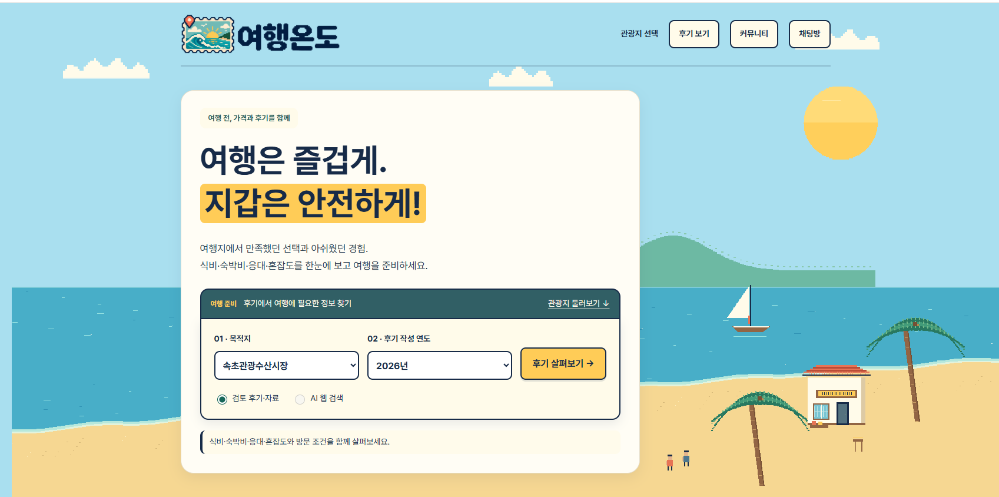

- **관광지 · 연도별 종합 후기**: 9개 관광지를 지역별로 탐색하고, 선택한 연도의 후기에서 반복되는 칭찬·불만·주요 이슈와 식비·숙박·서비스·혼잡도를 나눠 요약
- **로컬 AI 후기 분석 (관리자 전용)**: Ollama에 시스템 프롬프트와 JSON 스키마를 넘겨 후기를 구조화하고, 응답의 형식·출처 ID·날짜를 서버에서 검증. 연결 실패·시간 초과·잘못된 JSON을 구분해 처리하고 동시 분석은 1건으로 제한
- **AI 웹 검색**: Gemini API + Google Search grounding으로 후기를 검색하고, 출처가 연결되지 않은 응답은 오류로 처리. API 키는 서버 환경변수로만 관리
- **커뮤니티**: 질문·자유 게시판, 관광지 태그, 익명 글·댓글·사진 첨부. 수정·삭제 권한을 서버에서 검증 (Spring Security 세션 로그인, CSRF, BCrypt), 카카오·구글 OAuth2 로그인
- **그룹 채팅 · 결제**: WebSocket 그룹 채팅방(초대 링크, 참여 권한 확인), 카카오페이 후원 결제(서버에서 금액·주문 검증)
- **테스트**: JUnit·MockMvc 테스트 51개로 인증·권한, 입력값, 관광지·연도별 조회, 외부 API 오류 응답을 점검하고 GitHub Actions로 push·PR마다 실행

`Java 17` `Spring Boot 3.5` `Spring Security` `Spring Data JPA` `Thymeleaf` `WebSocket` `MySQL` `JavaScript` `Ollama` `Gemini API` `GitHub Actions`

<b>📸 화면 더 보기</b>

 

| 관광지 선택 | 비용과 방문 경험 상세 분석 |
| :-: | :-: |
| 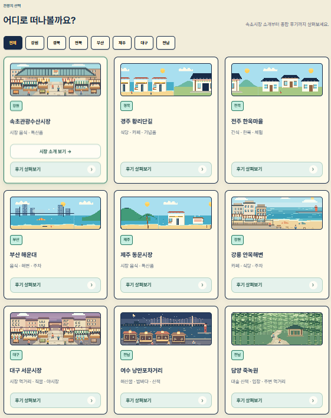 | 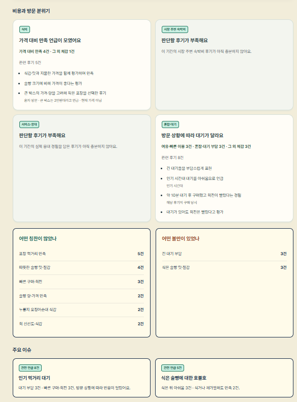 |
| **관광지별 종합 후기** | **커뮤니티** |
| 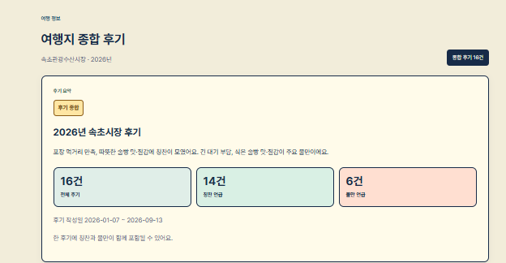 | 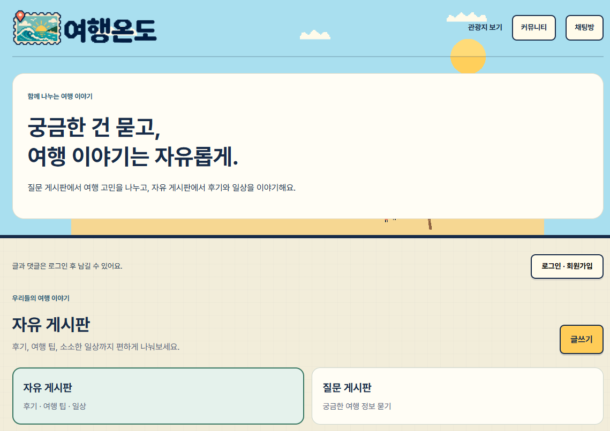 |

<b>🏗 서비스 구조 · AI 분석 흐름</b>

 

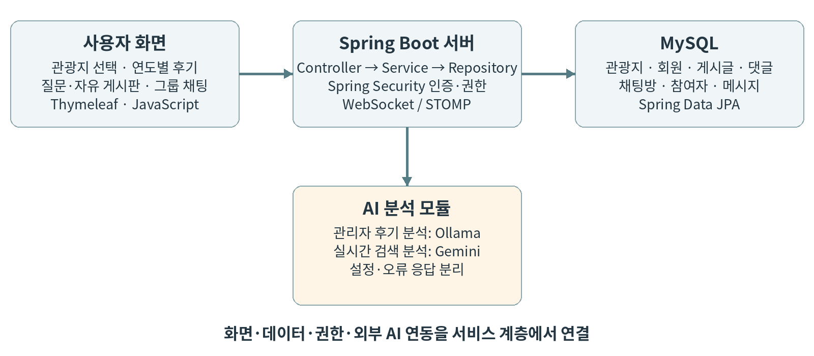

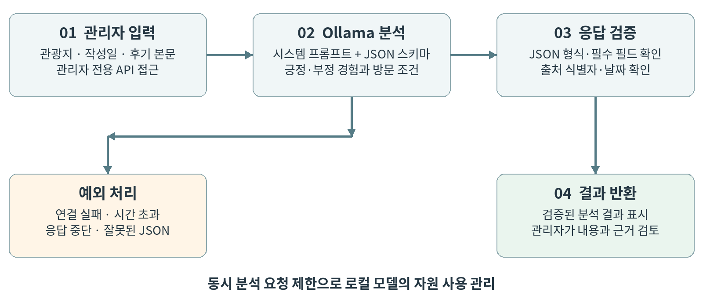

<b>🔧 기술적 과제와 해결</b>

 

| 과제 | 해결 |
| --- | --- |
| AI 결과의 형식·근거 불일치 | 구조화된 응답과 JSON 스키마 검증을 적용하고, 출처·날짜가 입력과 맞지 않는 결과는 거부 |
| 외부 AI 서비스 미연결·지연 | 설정 여부와 연결 상태를 분리하고, 예외 유형별 응답과 동시 요청 제한을 구성 |
| 다른 관광지·연도의 자료 혼입 | 관광지 식별자와 작성 연도로 조회·표시 범위를 제한하고, 자료가 없으면 빈 결과 반환 |

### 🎧 StreamWave — 음악 스트리밍 + 라이브 방송 플랫폼

> **팀 프로젝트 (3명)** · 2026.08.24 – 2026.09.09 (본인 참여 기간) · [저장소 보기](https://github.com/JOJOJACK-cmyk/-MUSIC-main2)
>
> 담당: 라이브 방송 백엔드 · 운영 배포 환경

YouTube 음원 스트리밍과 OBS 라이브 방송을 합친 음악 플랫폼입니다.
시청자가 방송을 보며 실시간으로 채팅하고 신청곡에 투표할 수 있습니다.

- **라이브 방송 파이프라인**: OBS → SRS(RTMP) → HLS 구조를 Docker로 구성하고, `on_publish` / `on_unpublish` 웹훅으로 실제 송출 기준으로 방송 ON/OFF를 자동 동기화 (종료 시 투표 데이터까지 정리). HLS 조각 2초 → 1초, 윈도 10초 → 6초로 조정
- **실시간 시청자 수**: 시청 화면이 5초마다 보내는 heartbeat를 Redis Sorted Set에 기록하고, 15초 이상 응답 없는 시청자를 제거한 뒤 `ZCARD`로 집계. 탭 종료·네트워크 단절도 최대 15초 안에 반영되고, 방송 종료 후에는 키 TTL(1분)로 자동 정리
- **실시간 채팅 · 신청곡 투표 (초기 구현)**: STOMP/SockJS 경로를 설계하고, Redis Set으로 중복 투표를 막고 Sorted Set으로 득표를 집계해 상위 10곡을 실시간 전송. 다음 곡 선택은 방송 소유자만 가능하도록 검증
- **운영 배포**: MySQL·Redis·SRS·Spring Boot·Caddy를 Compose 하나로 구성 — 멀티스테이지 빌드, MySQL 헬스체크 후 백엔드 기동, Redis AOF, Caddy 자동 HTTPS. 외부에는 80/443과 OBS 송출용 1935만 공개
- **데이터 모델 · 인증**: 이용권·결제 엔티티를 User 연관관계(`@ManyToOne(LAZY)` + FK)로 전환하고, 결제 `order_id`·`payment_key` UNIQUE로 중복 처리를 DB에서 방어. Google·Kakao·Naver 로그인 사용자 식별을 `AuthenticatedUserResolver`로 공통화
- 이 밖에 YouTube 플레이어, AWS S3 파일 업로드, Redis 기반 TOP 100 차트의 초기 구현에 참여

`Java 25` `Spring Boot 4.1` `Spring Security` `JPA` `MySQL` `Redis` `SRS 6 (RTMP / HLS)` `WebSocket (STOMP)` `React 18` `hls.js` `Docker Compose` `Caddy` `AWS S3`

<b>🏗 구조 다이어그램</b>

 

**방송 송출 · 상태 동기화 · 시청 흐름**

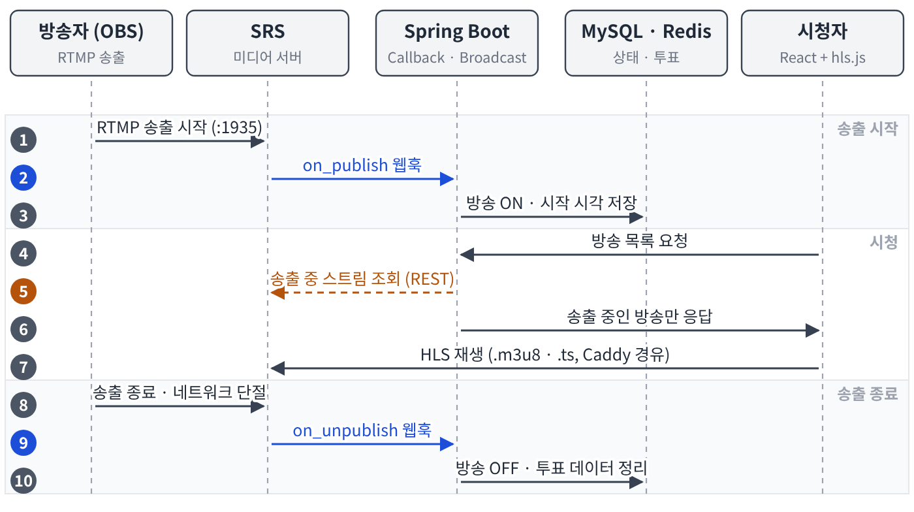

**Redis Sorted Set 기반 시청자 수 집계**

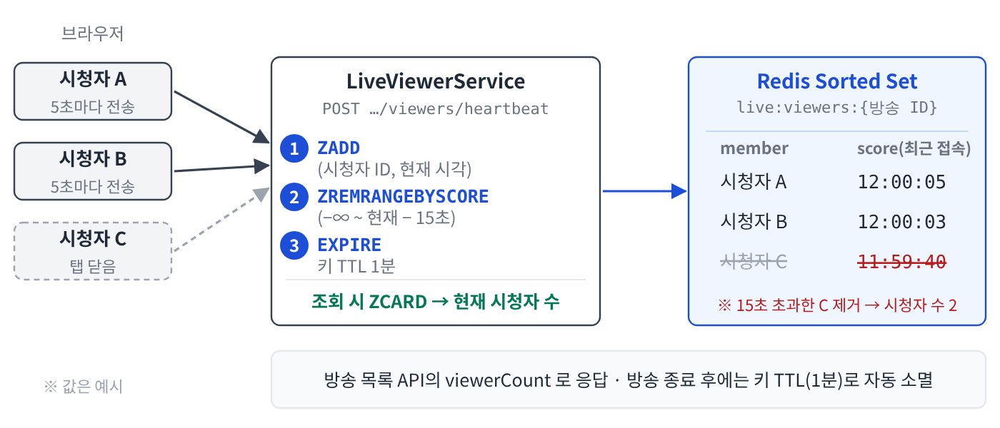

**신청곡 투표 · 다음 곡 선택 (초기 구현 기준)**

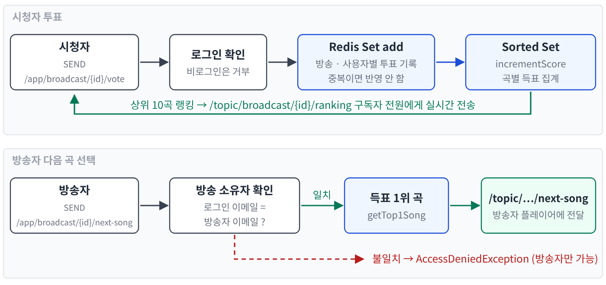

**운영 배포 구성 (외부 공개 포트 최소화)**

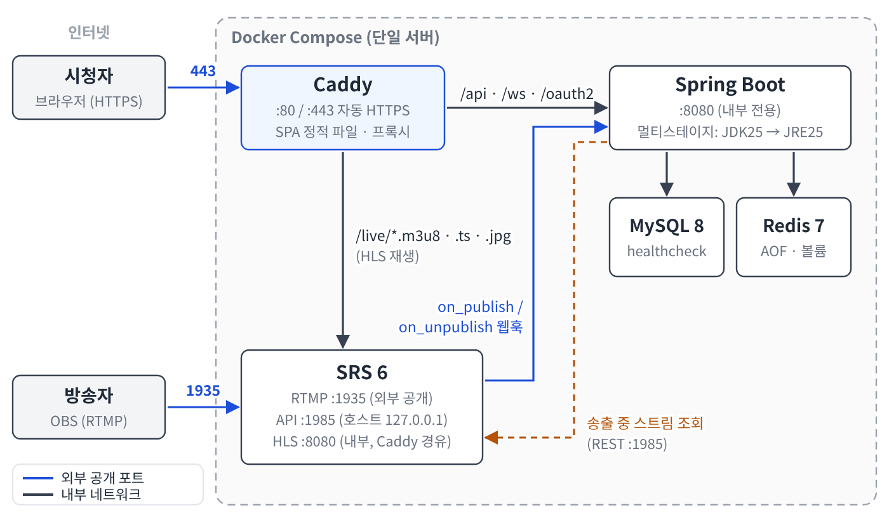

<b>🔧 트러블슈팅</b>

 

**1. SRS 장애가 서비스 전체 장애로 번지는 문제**
- 문제: SRS가 재시작되거나 죽으면 라이브 목록 API 전체가 500 에러
- 원인: 목록이 SRS HTTP API 조회에 의존하는데, 연결 실패 예외가 그대로 전파됨
- 해결: SRS 연결 실패를 처리해 경고 로그만 남기고 빈 목록 반환
- 결과: 미디어 서버 장애가 음악 재생·로그인 등 다른 기능으로 번지지 않음

**2. 컨테이너의 SRS가 호스트의 백엔드로 웹훅을 보내야 하는 문제**
- 문제: 개발 환경에서 SRS는 컨테이너, 백엔드는 호스트(IDE)에서 실행되어 `localhost`로는 웹훅 전달 불가
- 해결: `host.docker.internal` + `extra_hosts: host-gateway`로 리눅스 Docker에서도 동작하게 하고, 운영은 Compose 서비스명 `backend:8080`으로 분리
- 결과: 개발·운영 모두 같은 훅 구조로 방송 상태 동기화

**3. 로컬 주소가 코드에 고정되어 서버 배포가 불가능한 문제**
- 문제: OAuth 리다이렉트(`localhost:3000`)와 HLS 주소(`localhost:8081`)가 코드에 하드코딩
- 해결: `app.frontend-url` · `hls.base-url` · `srs.api.base-url` · CORS origin을 설정으로 분리해 prod 프로파일에서 주입. `RestClient`를 필드 초기화 시점에 만들면 `@Value` 주입 전이라 주소가 비는 문제도 생성자 생성으로 수정
- 결과: 같은 코드로 로컬과 서버 모두 동작

## 📫 Contact

<!--
  이메일, 블로그, 링크드인 등을 추가하려면:
  
  
-->
